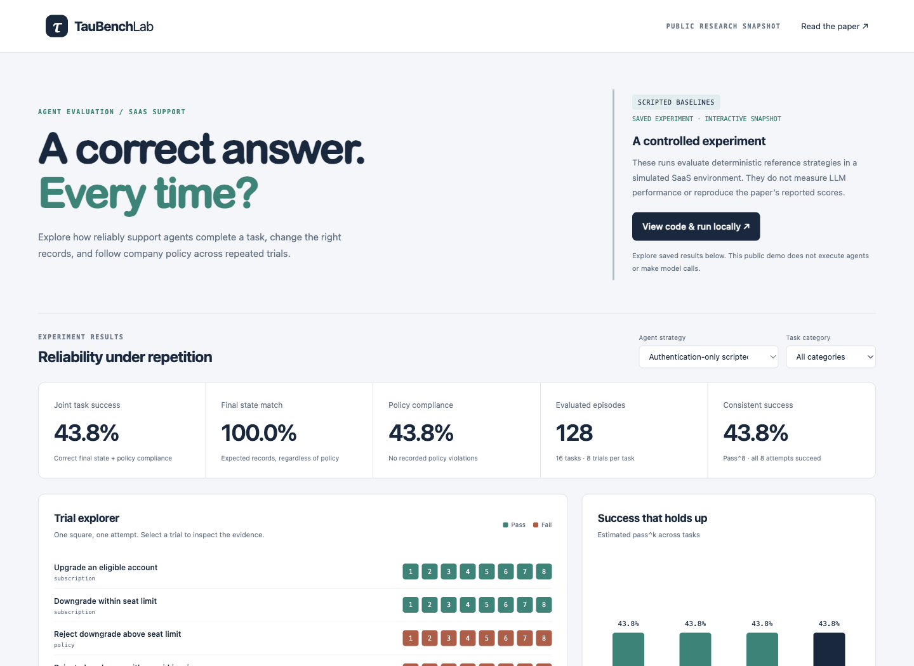

# TauBench Lab

**Can a support agent make the right change, follow the rules, and do it reliably?**

A research portfolio project based on [τ-bench](https://arxiv.org/abs/2406.12045), with a SaaS subscription-support extension and an interactive experiment dashboard.

[Explore the public demo](https://ianroyes-sys.github.io/taubench-lab/) · [Read the results](docs/RESULTS.md) · [Experiment design](docs/EXPERIMENTS.md)

**Finding:** the authentication-only scripted agent reached the correct final state in 100% of its trials, but achieved joint state-and-policy success in only 43.75%. Tool safeguards prevented invalid changes while trace checks exposed the attempted violations. This is a result on synthetic development fixtures, not a claim about deployed LLMs.

[](https://ianroyes-sys.github.io/taubench-lab/)

Three distinct deliverables:

1. **Archived research analysis:** independently recalculate pass^k from 1,980 episodes published by the original authors, with pinned source hashes. These are their model runs, not newly generated results.
2. **Original SaaS extension:** 16 synthetic tasks, three scripted strategies, eight seeded trials each: 384 recorded episodes with exact database-state checks, authentication, consent, policy violations, and readable traces.
3. **Live experiment adapter and protocol:** an optional bounded OpenAI-compatible agent adapter plus an upstream replication recipe. Live inference has not been run; the local user simulator is scripted.

## Run in one minute

Python 3.9 or later. No packages, API credentials, or paid services required for the default experiment.

```sh
git clone https://github.com/ianroyes-sys/taubench-lab.git
cd taubench-lab
python3 -m taulab run --output results/latest.json
python3 server.py
```

Open **http://127.0.0.1:8765**. Select an agent, filter tasks, and click any trial to inspect its conversation, database differences, and policy checks. The run button reruns only the free scripted experiment.

```sh
python3 -m unittest discover -s tests -v
node --check web/app.js
```

## What the experiment tests

- Subscription upgrades, downgrades, cancellations, seat limits, and unpaid balances.
- Refund eligibility, expired windows, unpaid invoices, and duplicate refunds.
- Owner permissions, member removal, and workspace exports.
- Authentication-code formatting and withdrawn user consent.

The **naive** agent implements the basic happy path. The **authentication-only** ablation parses verification codes correctly but lacks business-rule checks. The **policy-aware** reference implements the fixture's rules and respects consent. This is a controlled harness validation, not a comparison of LLM capabilities. A perfect reference-agent score is expected and does not establish generalization.

**State match** compares the entire final account against an independently defined goal. **Joint success** additionally requires no recorded policy violations and no execution error. The tools reject prohibited changes and record attempted violations, so a denial can leave the correct state while still revealing a bad agent decision. Language-only violations are not exhaustively scored.

For c successful trials out of n on each task:

`pass^k = average_across_tasks(combinations(c, k) / combinations(n, k))`

This measures success across all k trials. It differs from pass@k, which asks whether at least one attempt succeeds. The dashboard's local curve uses joint success; archived curves use the authors' recorded rewards.

## Recalculate the authors' archived results

```sh
python3 scripts/analyze_upstream.py --download
```

This downloads four public archived files from the pinned official commit and verifies their SHA-256 hashes. It makes no model calls. To use an existing upstream checkout:

```sh
python3 scripts/analyze_upstream.py --source-dir /path/to/tau-bench/historical_trajectories
```

See [results/upstream_reanalysis.json](results/upstream_reanalysis.json) for provenance, per-task rewards, and calculated estimates. Original transcripts remain upstream. Archive dates and task revisions may differ from the paper's first version, so this is not an exact replication of a published table.

## Optional live SaaS experiment

The adapter requires `TAULAB_MODEL`, `TAULAB_API_KEY`, and optionally `TAULAB_BASE_URL` (an OpenAI-compatible `/v1` endpoint). Configure these privately in your shell. A local endpoint that ignores authentication can use a placeholder key.

```sh
python3 -m taulab run --mode live --output results/live-experiment.json
```

This runs 128 episodes by default, each with at most 12 model requests and 512 requested output tokens per request. Use provider spending controls before a paid run. Provider usage is recorded when returned; it is not a dollar-cost estimate. Models that do not support this tool-calling schema or token parameter need adapter changes. Live compatibility and performance remain unverified. The dashboard run button does not invoke this mode.

For the original retail benchmark and a proper held-out model comparison, follow [the experiment protocol](docs/EXPERIMENTS.md).

## Release verification

The 27-test suite and seeded-result consistency checks were run locally before publication. GitHub Actions templates are provided in `.github/workflow-templates/`; they are not active workflows. Activating them requires workflow permission and moving the files to `.github/workflows/`. The current public demo is published from the `gh-pages` branch.

## Read the project

| File | Purpose |
|---|---|
| [Paper notes](docs/PAPER.md) | Methodology, source pin, implementation map, and deviations |
| [Experiment protocol](docs/EXPERIMENTS.md) | Reproduction recipe and future held-out experiment |
| [Measured results](docs/RESULTS.md) | Results from the included artifacts |
| [Portfolio guide](docs/PORTFOLIO.md) | Resume bullets and interview walkthrough |
| `taulab/benchmark.py` | Tasks, isolated environment, agents, evaluation, and metrics |
| `taulab/live.py` | Optional tool-calling model adapter |
| `data/` | Readable exports of task fixtures and policy; code is authoritative |
| `web/` | Dependency-free dashboard |

## Attribution and scope

Based on Shunyu Yao, Noah Shinn, Pedram Razavi, and Karthik Narasimhan, *τ-bench: A Benchmark for Tool-Agent-User Interaction in Real-World Domains* (2024). [Paper](https://arxiv.org/abs/2406.12045) · [Official source](https://github.com/sierra-research/tau-bench).

The SaaS domain and dashboard are independent additions. This project is not affiliated with Sierra. It has not replicated the paper's LLM experiments, established improvements on real customer work, or been deployed as a production support service.

Implementation and documentation were developed with AI coding assistance. The repository includes executable checks, explicit limitations, and saved evidence so its claims can be independently inspected. Original project code is MIT licensed; see [NOTICE](NOTICE) for upstream attribution.
